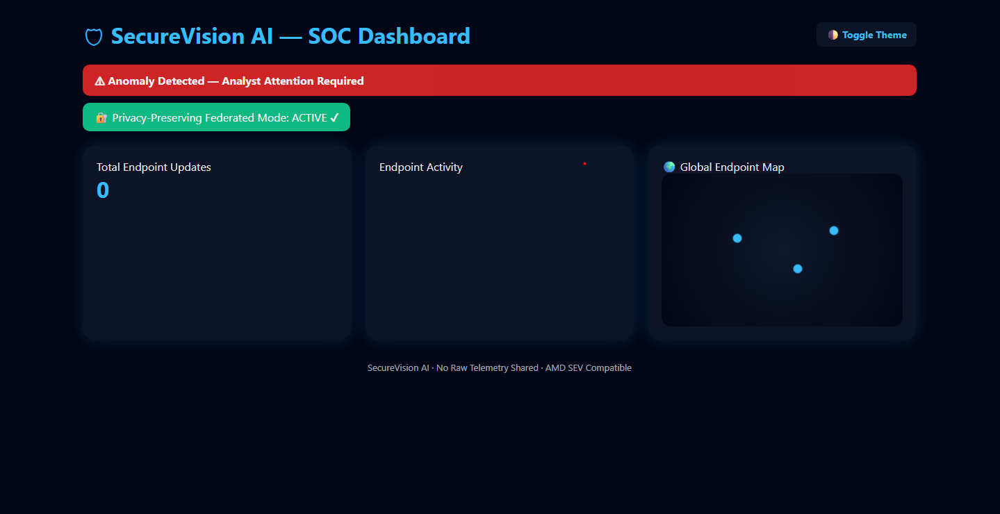
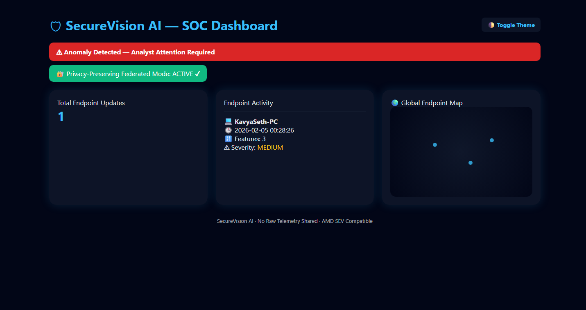
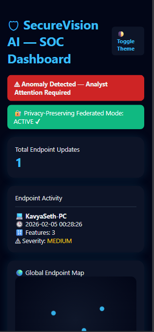

# 🛡️ SecureVision AI
<h3>Privacy-Preserving Federated Cyber Threat Detection Platform</h3>

SecureVision AI is a working cybersecurity prototype that demonstrates how AI-based threat detection can be performed without sharing raw endpoint telemetry, using federated learning concepts and privacy-by-design architecture.

Built for the AI + Cybersecurity & Privacy track.

<h2>🚀 Problem Statement</h2>

Traditional cybersecurity solutions:

- Centralize raw endpoint logs and telemetry

- Increase privacy, compliance, and breach risks

- Create a single point of failure

Modern organizations need:

- Real-time threat detection

- Strong privacy guarantees

- Scalable and secure architectures

<h2>💡 Solution Overview </h2>

SecureVision AI solves this by:

- Running AI anomaly detection locally on each endpoint

- Sharing only privacy-safe metadata with the SOC

- Never transmitting raw logs, files, or personal data

This ensures:

- 🔐 Privacy preservation

- ⚡ Real-time detection

- 📊 Centralized SOC visibility

<h2> 🤖 AI & Security Design </h2>

<h3>Endpoint AI</h3>

- Uses Isolation Forest (unsupervised ML)

- Detects unknown and zero-day anomalies

- Lightweight and endpoint-friendly

<h3>Privacy-Preserving Design</h3>

- No raw telemetry leaves the endpoint

- Only metadata (hostname, features, severity)

- GDPR-friendly and enterprise-ready

<h3>Federated Learning Concept</h3>

- Local model training on each endpoint

- Central intelligence aggregation

- Privacy preserved by default

<h2>🖥️ SOC Dashboard Features</h2>

- Real-time endpoint activity

- Blinking anomaly alerts

- Severity-based color coding

    - LOW → Green

    - MEDIUM → Yellow

    - HIGH → Red

- Global endpoint visualization (simulated map)

- Auto-refresh every 5 seconds

- Dark / Light mode toggle

- Fully responsive (mobile, tablet, desktop)

## 📸 Screenshots

### 🖥️ SOC Dashboard — Dark Mode

  

---

### 🚨 Endpoint Alert with Hostname

  

---

### 📱 Responsive Mobile View

  

<h2>🔐 AMD Technology Alignment</h2>

SecureVision AI is designed to be:

- Confidential Computing ready

- Compatible with AMD Secure Encrypted Virtualization (SEV)

- Secure for deployment in untrusted cloud environments

<h2>🧪 How to Run the Project</h2>

1.  Clone the Github Repository

        git clone https://github.com/kavya-seth-vns/SecureVision-AI.git
  
3. Create Virtual Environment
   
       python -m venv venv
   
       cd venv\Scripts\activate

4. Install Dependencies

       python -m pip install pandas scikit-learn flask requests

5. Start SOC Aggregator

       cd aggregator

       python app.py

6. Run Endpoint Agent

       cd endpoint

       python agent.py

7. Open Dashboard
   
   http://127.0.0.1.5000

   

<h2>📁 Project Structure</h2>

securevision-ai/

├── aggregator/     # Central SOC dashboard & API

├── endpoint/       # Endpoint-side AI agent

├── README.md

└── .gitignore

<h2>🎯 Why SecureVision AI Stands Out</h2>

- Fully working AI prototype (not a mock UI)

- Strong focus on privacy & security

- Real-world SOC use case

- Modern, responsive dashboard

- AMD-aligned confidential computing design

- Scalable and enterprise-ready

<h2>🚀 Future Enhancements</h2>

- True federated model aggregation

- Differential privacy noise injection

- SOC alert acknowledgment workflow

- Role-based access control

- Cloud deployment on confidential VMs

<h2>🏁 Conclusion</h2>

SecureVision AI demonstrates that powerful cybersecurity intelligence can be achieved without compromising user privacy, using federated AI principles and confidential computing concepts.

<h2>👥 Team</h2>

Team Name: SecureVision

Team Member: Kavya Seth , Sristi Seth , Prashant Kumar Srivastava

Hackathon: AMD Slingshot / Hack2Skill

AI-powered cybersecurity intelligence without compromising privacy.
